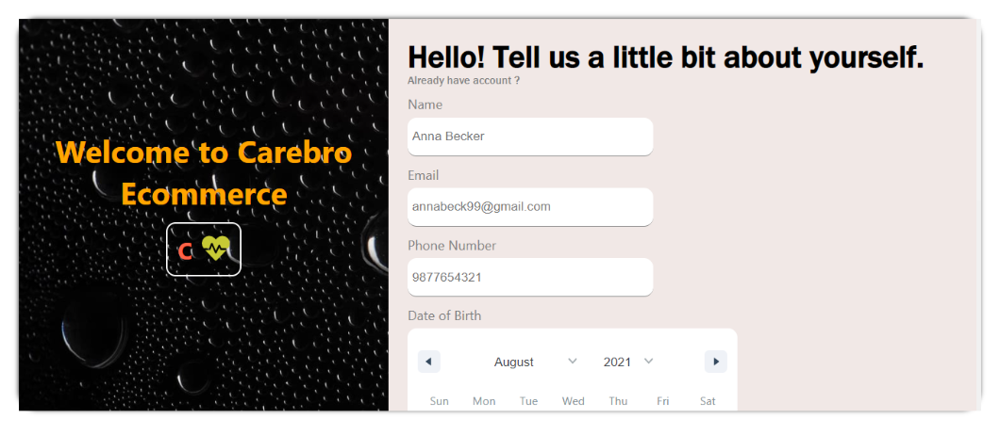
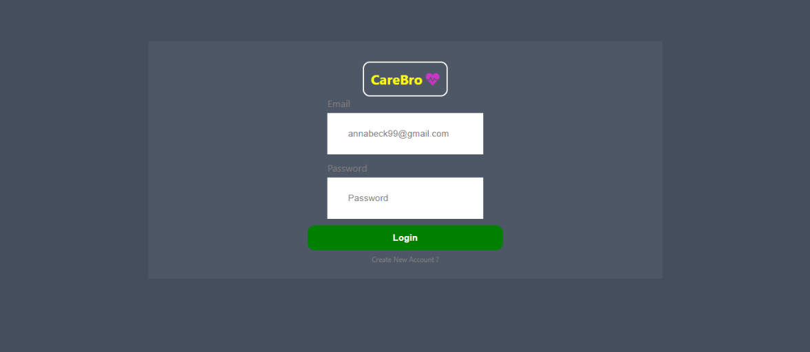
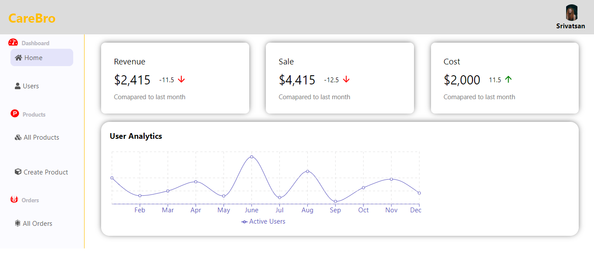
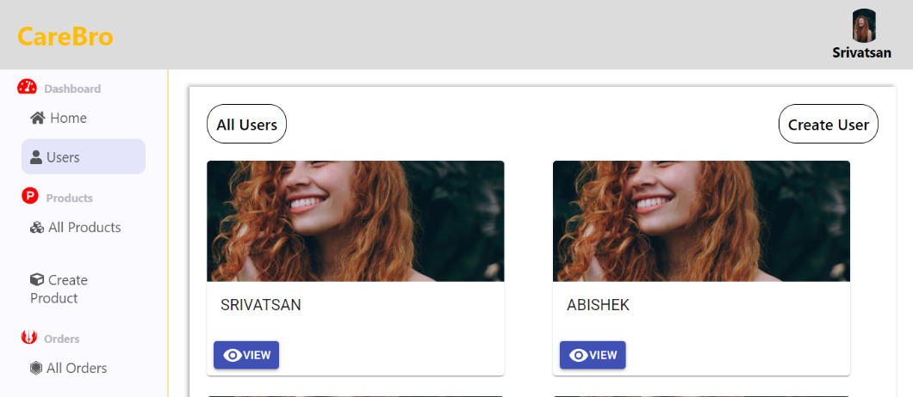
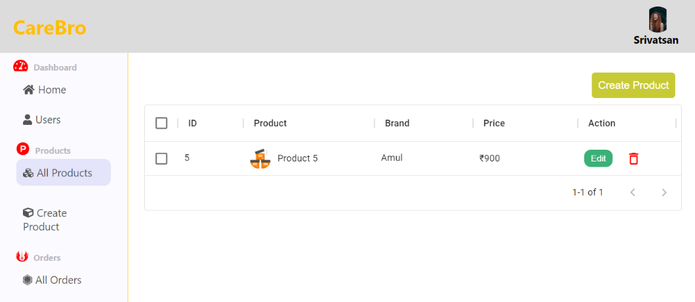
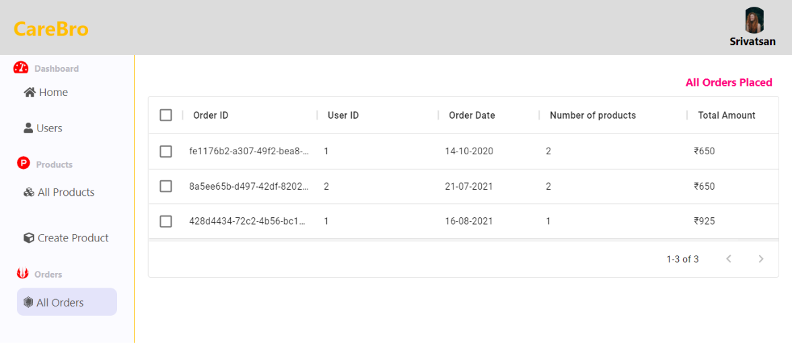

# E-Commerce 

-> Entire projects work with the localstorage to store data and redux as state management

Project includes functionality to Sign up and log in user and they are categorized by roles
### Admin - 0 
### User - 1

## Login

* Gets the user email and password and compares with the list of all users and checks if the user exists or not and if the password matches exactly or not.

## Signup

- Basic user details like name, phone, email, password etc.

## User Module

* List of all users

* User Details and their orders 

* Admin and respective user have the authorization to edit their profile while everyone can view it.

## Product Module

- List of all products with details

- Create a new product
 
- Edit the product values

- Delete a product

## HomePage

* Shows static value of the products sold, sale and revenue

* It also shows the chart representation of the users signed up over the year

* Both are static dummy values

## All Orders

- Shows the list of all orders placed

---------------------------------

Some of the screenshots from the project are attached below 🤩

---------------------------------

---------------------------------

---------------------------------

---------------------------------

---------------------------------

---------------------------------

Keep Learning! 
Keep hustling!

